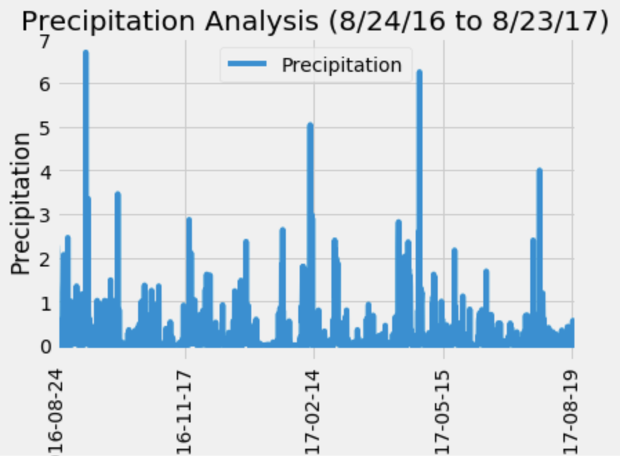
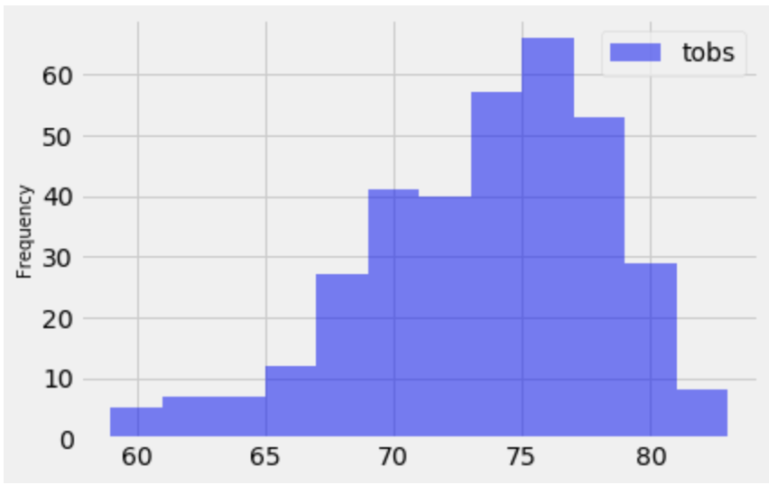
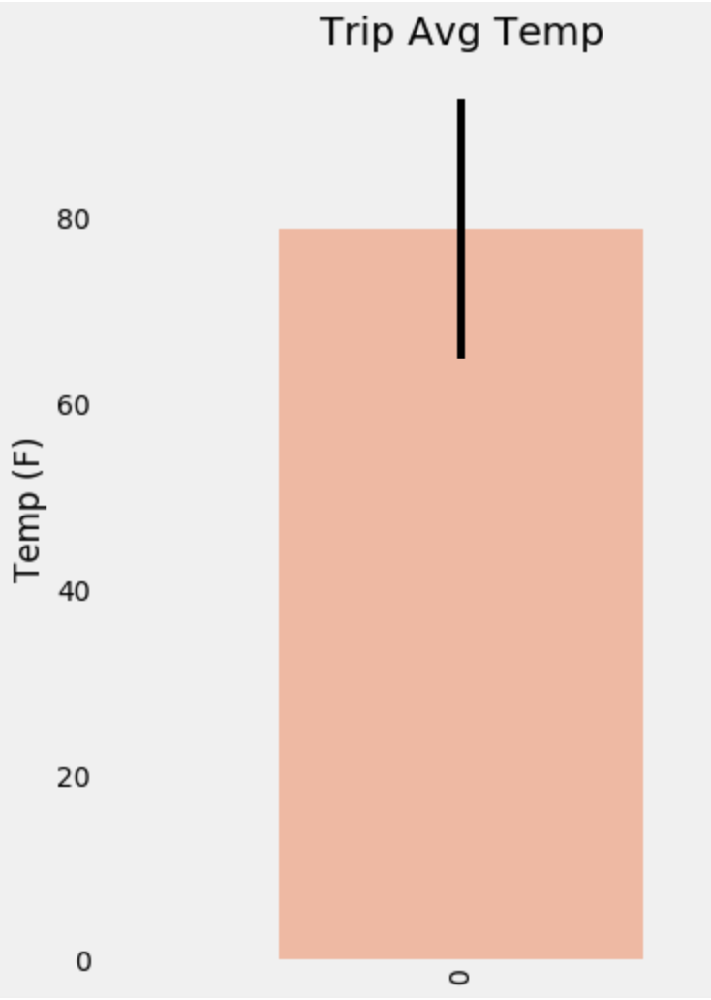
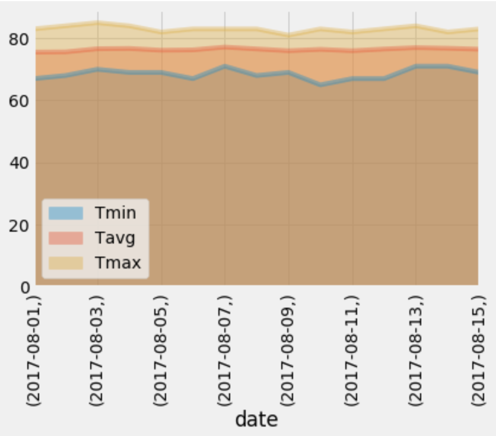

# SQLAlchemy Challenge

## Overview: 

SQLAlchemy and a Flask API were used to pull climate data from the hawaii.sqlite weather station tables. Exploration and analysis of the climate data was done using Python, Pandas, API, SQL, SQLAlchemy and Object Relational Mapper (OMR). Specific dates were chosen for the analysis, and Matplotlib was used to graph the results. 

## Workflow:

An engine was used to connect to the sqlite database, and automap_base() was used to reflect the existing database into a new model. The resulting classes, measurements and stations, were analyzed:

The last 12 months of precipitation data from measurements:

The station with the highest number of temperature observations was selected. The last 12 months of temperature observation data for this station were visualized: 

A function called `calc_temps` was created to return the minimum, average, and maximum temperatures for a chosen range of dates. The results were graphed in a bar graph to visualize the trip average temperature: 

 

Rainfall?

A function called `daily_normals` was created to return the averages for minimum temperature, maximum temperature, and average temperature for all historic data matching a specific month and day. These values were calculated for all days of the chosen range of dates and results were graphed in an area plot:

 
